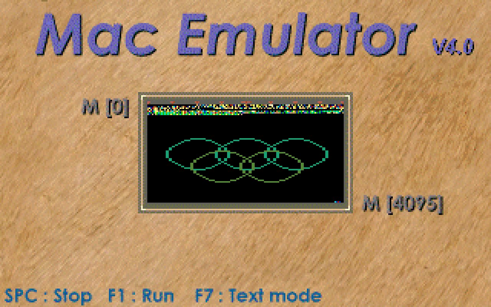

# MACEMU 4.0c — emulatore MAC-1 per Windows


Port fedele per .NET 8 (WinForms, solo Windows) del celebre emulatore DOS
del **MAC-1**, scritto nel 1996 da F. Ferrara, G. Baragiotta e A. Carrera
(gruppo ARCHA8, Università di Torino). Stessa CPU, stesso microprogramma,
stessa interfaccia.

## Download

Scarica **`MACEMU64-v4.0c.zip`** da
[Releases](https://github.com/ciskje/MACEMU64.NET/releases/latest),
scompatta ed esegui `MACEMU64.EXE` (self-contained, non serve installare .NET).

## Avvio rapido

Lancia `MACEMU64.EXE` (self-contained, non serve installare .NET):

1. `LOAD PROGRAM` → scrivi `FIBO.MAC` → Invio → ESC
2. Freccia giù fino a `RUNNING MENU` → Invio → **F1** per RUN
3. Con `CIRCLES.MAC`, premi **F9** per la vista grafica (MEMDISPLAY):



Tasti come l'originale: `F1` RUN, `F2` micro-passo, `F3` macro-passo,
`F4`–`F6` registri/breakpoint, `F7`/`F8`/`F9`/`F10` modalità video,
`PgUp`/`PgDn` scroll, `Alt+I`/`R`/`J`/`A`, `ESC` indietro.

## Primi passi (per gli amici)

Vale uguale per `MACEMU64.EXE` e per la versione browser:

1. **Primo giro**: `LOAD PROGRAM` → scrivi `FIBO.MAC` → Invio → ESC,
   freccia giù fino a `RUNNING MENU` → Invio → **F1**. Vedi i registri
   correre e alla fine `PROGRAM TERMINATED`.
2. **La grafica**: stesso giro ma carica `CIRCLES.MAC`, poi in RUN premi
   **F9** (MEMDISPLAY): i cerchi si disegnano nella memoria video.

## Versione browser

`MACEMU.NET/MacEmu.Web` è lo stesso emulatore in una pagina web
(Blazor WebAssembly, hosting statico: funziona su Windows, macOS e Linux
senza installare nulla). Riusa `MacEmu.Core` al 100%: stessa CPU, stessi
assembler MiniC/Masm integrati come tab nella pagina.

```powershell
cd MACEMU.NET
dotnet run --project MacEmu.Web              # prova locale (http://localhost:…)
dotnet publish MacEmu.Web -c Release         # output statico in bin/Release/…/wwwroot
```

Note browser: `F5` (reload) e `F11` restano del browser, `Alt+lettera`
può essere intercettato dal SO. Su macOS `Alt` = `Option`. Clicca sullo
schermo per dargli il focus tastiera, poi tutto come l'originale
(frecce/Invio nei menu, `F1` RUN, `F2`/`F3` passi, `F4`–`F6`, `F7`–`F10`
video, `PgUp`/`PgDn`, `Alt+I`/`R`/`J`/`A`, `ESC`). I file dal disco si
scelgono col selettore del browser quando il dialogo dice "File not found!".

### Metterlo sul tuo server web

Copia il **contenuto** di
`MacEmu.Web/bin/Release/net8.0/publish/wwwroot` nella root del sito
(solo file statici, ~15MB: nessun .NET da installare sul server).

- **IIS**: `web.config` già incluso (MIME `.wasm`/font/`.mac`/`.mic`/`.bcf`
  + no-cache su `index.html` e `blazor.boot.json`).
- **nginx**: MIME già mappati; per i precompressi `.br`/`.gz` (generati in
  `_framework/`) aggiungi `brotli_static on;` / `gzip_static on;` se hai
  i moduli, altrimenti vengono serviti i file normali.
- **Apache**: aggiungi `AddType application/wasm .wasm`.
- **Sottocartella** (es. `https://server/macemu/`): cambia in `index.html`
  `<base href="/">` in `<base href="/macemu/">`.

## Cosa include

- **Core fedele**: CPU MIC-1 a 4 fasi, Control Store 256 microword, 4K RAM,
  16 registri, tastiera/stampante/timer mappati in memoria, disassemblatore.
- **Assembler integrati**: macro-assembler (ex `MASM.EXE`) e micro-assembler,
  verificati byte-identici agli originali.
- **UI identica**: schermo testo 80x50 con font VGA 8x8 autentico, modalità
  grafica 64x64, splash screen originali.
- Programmi dimostrativi in `MACRO/` (`FIBO`, `CIRCLES`, `FLOWERS`, `SCHED`…).
- **MiniC**: sottoinsieme C che compila in assembly MAC
  (vedi [MINIC.md](MINIC.md)). In `MACRO/` trovi `minic.exe`
  (`minic PROG.C` → `PROG.MAC`), `masm.exe` (assembler
  standalone) e tutti i demo riscritti in C (`FIBO.C`,
  `CIRCLES.C`, …) più `UTILITY.H` con plot, timer e scheduler.

## Compilare dai sorgenti

```powershell
cd MACEMU.NET
dotnet build MacEmu.sln
dotnet test MacEmu.Tests/MacEmu.Tests.csproj   # 17/17 test di fedeltà
```

I sorgenti C originali sono in `SOURCE/`, i binari DOS storici in `BIN_ORIGINALI/`.

## Licenza

MIT — vedi [LICENSE](LICENSE).

- Font `Px437 IBM EGA 8x8` di VileR (int10h.org), licenza CC BY-SA 4.0
  (attribuzione in `MACEMU.NET/assets/Fonts/LICENSE-int10h.txt`).
- Programma originale © 1996 F. Ferrara, G. Baragiotta, A. Carrera.
