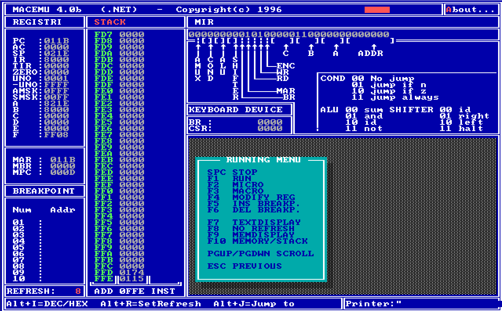

# MACEMU 4.0b — emulatore MAC-1 per Windows



Port fedele per .NET 8 (WinForms, solo Windows) del celebre emulatore DOS
del **MAC-1**, scritto nel 1996 da F. Ferrara, G. Baragiotta e A. Carrera
(gruppo ARCHA8, Università di Torino). Stessa CPU, stesso microprogramma,
stessa interfaccia.

## Avvio rapido

Lancia `MACEMU64.EXE` (self-contained, non serve installare .NET):

1. `LOAD PROGRAM` → scrivi `FIBO.MAC` → Invio → ESC
2. Freccia giù fino a `RUNNING MENU` → Invio → **F1** per RUN

Tasti come l'originale: `F1` RUN, `F2` micro-passo, `F3` macro-passo,
`F4`–`F6` registri/breakpoint, `F7`/`F8`/`F9`/`F10` modalità video,
`PgUp`/`PgDn` scroll, `Alt+I`/`R`/`J`/`A`, `ESC` indietro.

## Cosa include

- **Core fedele**: CPU MIC-1 a 4 fasi, Control Store 256 microword, 4K RAM,
  16 registri, tastiera/stampante/timer mappati in memoria, disassemblatore.
- **Assembler integrati**: macro-assembler (ex `MASM.EXE`) e micro-assembler,
  verificati byte-identici agli originali.
- **UI identica**: schermo testo 80x50 con font VGA 8x8 autentico, modalità
  grafica 64x64, splash screen originali.
- Programmi dimostrativi in `MACRO/` (`FIBO`, `CIRCLES`, `FLOWERS`, `SCHED`…).

## Compilare dai sorgenti

```powershell
cd MACEMU.NET
dotnet build MacEmu.sln
dotnet test MacEmu.Tests/MacEmu.Tests.csproj   # 17/17 test di fedeltà
```

I sorgenti C originali sono in `SOURCE/`, i binari DOS storici in `BIN_ORIGINALI/`.

## Licenza

MIT — vedi [LICENSE](LICENSE).

- Font `Px437 IBM EGA 8x8` di VileR (int10h.org), licenza CC BY-SA 4.0
  (attribuzione in `MACEMU.NET/assets/Fonts/LICENSE-int10h.txt`).
- Programma originale © 1996 F. Ferrara, G. Baragiotta, A. Carrera.
